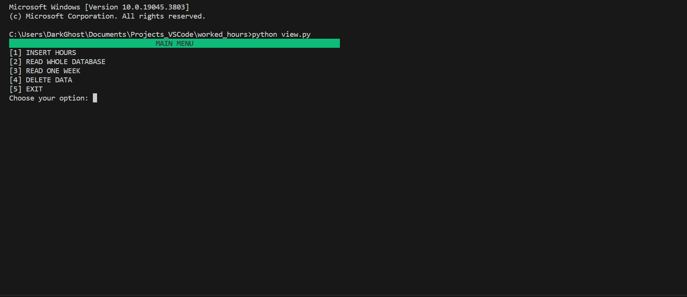
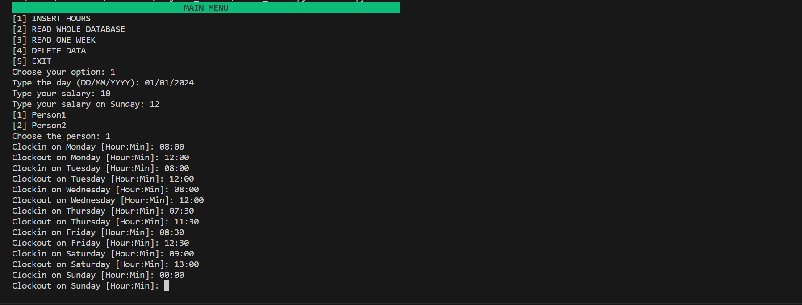
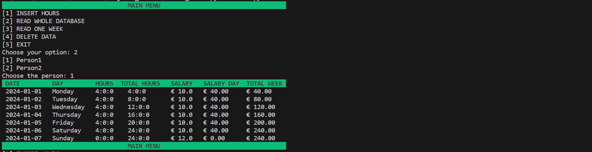

<h1 align="center">🇮🇪 Ireland Tax Calculator</h1>

### 📝 DESCRIPTION

<p align="justify">The program is designed to calculate the payroll tax in the Irish tax system.It prompts the user to input their gross salary, and then calculates and displays the payroll tax for Ireland based on the salary.<br>The program also calculates the payroll related social insurance (PRSI), universal social charge (USC), and income tax paid (ITP). Then, it displays the payroll details, including the gross salary, payroll tax, deductions, net pay, and the date and time of the calculation.
<br>Overall, the program is a useful tool for taxpayers who need to calculate and track their payroll tax in the Irish tax system</p>


### ⏭️ TABLE OF CONTENTS
1. [Description](#📝-description)
2. [Requirements](#💻-requirements)
3. [Run the project](#🚀-how-to-run-the-project)
4. [Contribute](#📫-how-to-contribute)
5. [Screenshots](###📸-screenshots)
6. [Teste](#teste📸)


### 💻 REQUIREMENTS
- [Python3](https://docs.python.org/3/)
- [SQLAlchemy](https://www.sqlalchemy.org)
- [VisualCode](https://code.visualstudio.com/docs)


### 🚀 HOW TO RUN THE PROJECT
```bash
You will download the controller.py, model.py and the view.py.

Run the view.py script. It will create the database automatically.
```


### 📫 HOW TO CONTRIBUTE
```bash 
# Fork this repository:
By clicking on the fork button on the top of this page. This will create a copy of this repository in your account.

# Clone this project:
git clone https://github.com/BLUCASS/Ireland_Tax_Calculator

# Create a branch using the command:
git checkout -b your-new-branch-name

# Make the changes and commit them:
git commit -m "commit-message"

# Send them to the original branch:
git push file-origin project-name / local
```

### teste📸

### 📸 SCREENSHOTS
<br><br>
<br><br>

